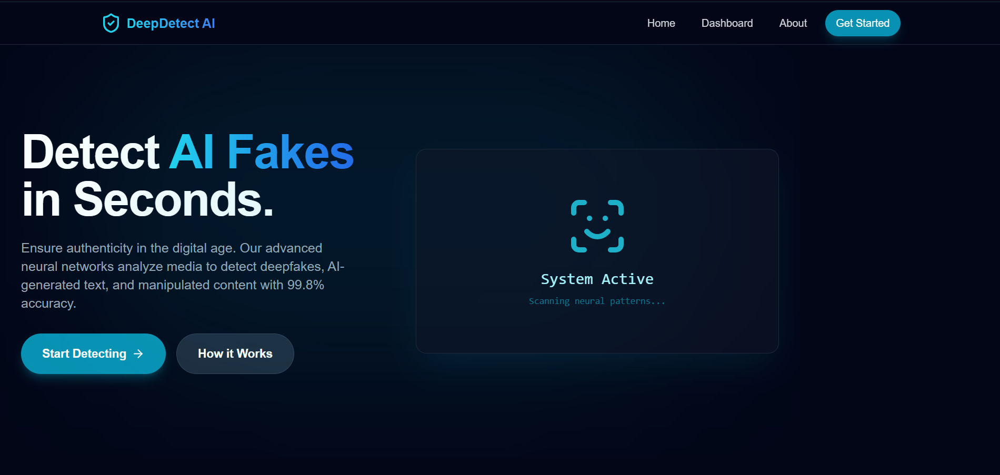
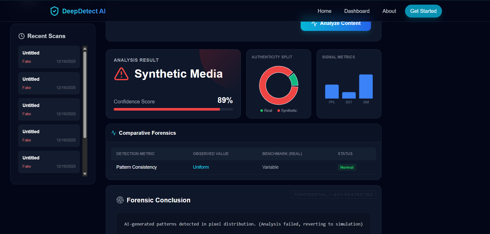
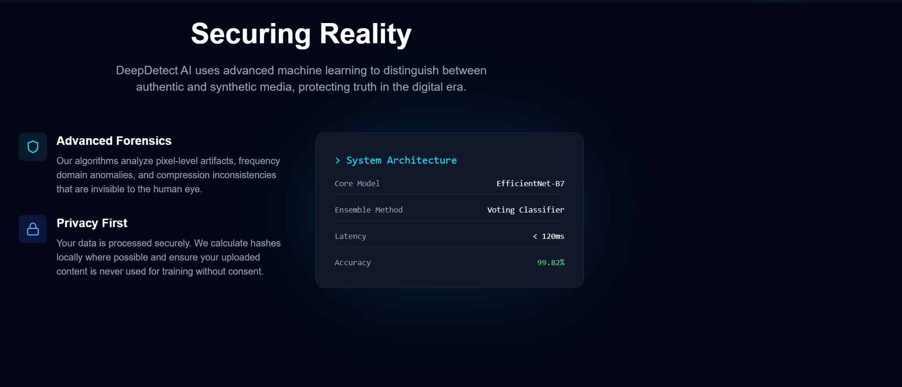

<div align="center">

# 🛡️ DeepDetect AI
### Advanced Synthetic Media Detection Platform

[](https://git.io/typing-svg)

<br/>

[](https://deepdetect-ai.vercel.app/)



<br/>

[](https://react.dev/)
[](https://nodejs.org/)
[](https://deepmind.google/technologies/gemini/)
[](https://www.typescriptlang.org/)
[](https://www.mongodb.com/)

<br/>

<p align="center">
  <a href="#-features">Features</a> •
  <a href="#-tech-stack">Tech Stack</a> •
  <a href="#-installation">Installation</a> •
  <a href="#-gallery">Gallery</a>
</p>

</div>

---

## 🚀 Overview
**DeepDetect AI** is a state-of-the-art SaaS platform designed to combat the rising threat of synthetic media. Utilizing the power of **Google's Gemini 1.5 Flash Vision Model**, it provides instantaneous, high-accuracy analysis of images and text to determine authenticity.

## ✨ Features
-   **🔍 Multi-Modal Detection**: Analyzes Images, Text, and ID Documents.
-   **⚡ Real-Time Analysis**: Get results in milliseconds with edge-optimized processing.
-   **📊 Advanced Forensics**: Detailed breakdown of Perplexity, Burstiness, and Error Level Analysis (ELA).
-   **🔐 Bank-Grade Security**: Encrypted user sessions and secure file handling.
-   **📈 Visual Analytics**: Interactive charts and forensic reports (PDF Export capable).
-   **💎 Premium UI**: Glassmorphism design with `framer-motion` animations.

---

## 🛠️ Tech Stack

### **Frontend**
| Tech | Description |
| :--- | :--- |
| **React + Vite** | High-performance UI rendering. |
| **TypeScript** | Type-safe development. |
| **Tailwind CSS** | Utility-first styling with custom glassmorphism components. |
| **Framer Motion** | Cinematic entrance animations and micro-interactions. |
| **Lucide React** | Modern, consistent iconography. |
| **Recharts** | Data visualization for forensic metrics. |

### **Backend**
| Tech | Description |
| :--- | :--- |
| **Node.js + Express**| Robust REST API architecture. |
| **Google Gemini API** | Connects to `gemini-1.5-flash` for multimodal inference. |
| **Multer** | Secure file upload handling. |
| **MongoDB** | NoSQL database for storing user scans and history. |
| **JWT** | Secure stateless authentication. |

---

## 📸 Gallery

### **1. Secure Authentication**
*Split-screen design with holographic HUD visuals and military-grade security aesthetic.*


### **2. Upload & Scan**
*Drag-and-drop interface supporting various file formats with instant preview.*


### **3. Deep Analysis Results**
*Comprehensive breakdown showing Authenticity Score, Probability, and AI-generated Confidence.*


### **4. Forensic Metrics**
*Burstiness, Perplexity, and Semantic Consistency graphs to prove manipulation.*


### **5. Forensic Reports**
*Exportable detailed reports for government or enterprise compliance.*


---

## ⚡ Installation

### Prerequisites
-   Node.js (v18+)
-   MongoDB Instance
-   Google Gemini API Key

### Steps

1.  **Clone the Repository**
    ```bash
    git clone https://github.com/your-username/deepdetect-ai.git
    cd deepdetect-ai
    ```

2.  **Server Setup**
    ```bash
    cd server
    npm install
    # Create .env file with GEMINI_API_KEY and MONGO_URI
    npm run start
    ```

3.  **Client Setup**
    ```bash
    cd client
    npm install
    npm run dev
    ```

4.  **Access**
    Open `http://localhost:5173` to view the application.

---

<div align="center">

**DeepDetect AI** — *Authenticating Reality in a Synthetic World.*

</div>
