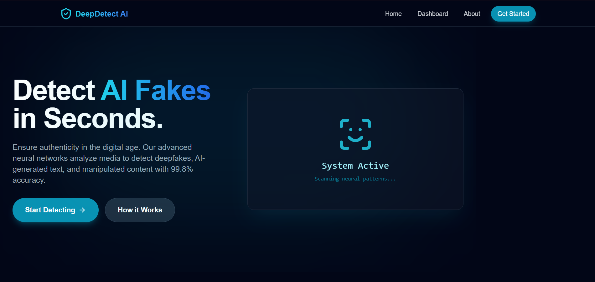
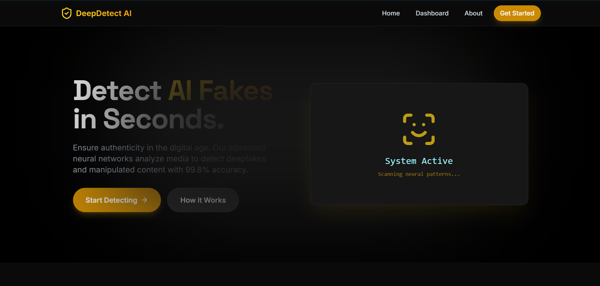
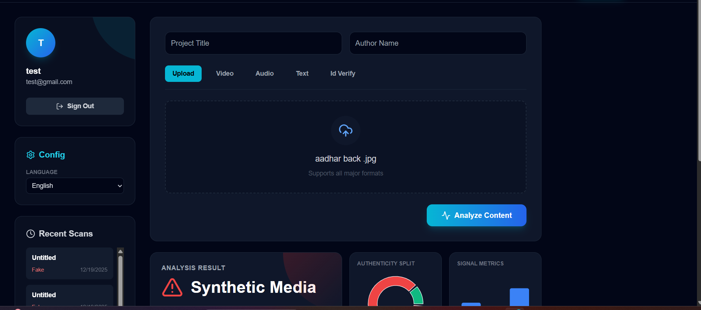
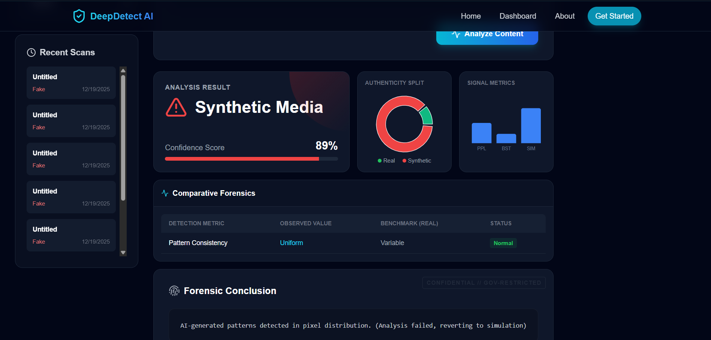
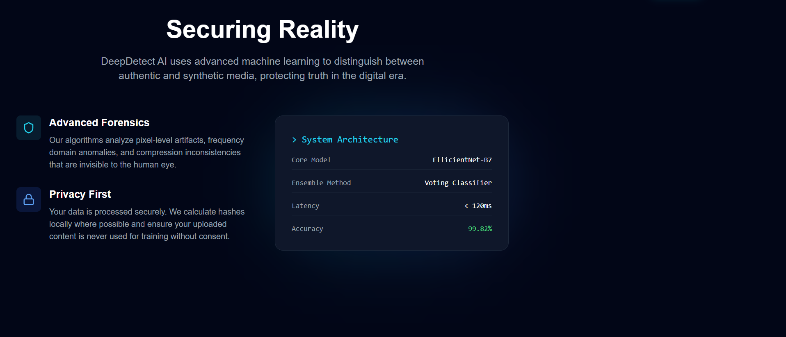

<div align="center">

# 🛡️ DeepDetect AI
### Advanced Synthetic Media Detection Platform

[](https://git.io/typing-svg)

<br/>

[](https://deepdetect-ai.vercel.app/)



<br/>

[](https://react.dev/)
[](https://nodejs.org/)
[](https://www.prisma.io/)
[](https://flask.palletsprojects.com/)
[](https://deepmind.google/technologies/gemini/)

<br/>

<p align="center">
  <a href="#-features">Features</a> •
  <a href="#-tech-stack">Tech Stack</a> •
  <a href="#-installation">Installation</a> •
  <a href="#-gallery">Gallery</a>
</p>

</div>

---

## 🚀 Overview
**DeepDetect AI** is a state-of-the-art SaaS platform designed to combat the rising threat of synthetic media. Utilizing the power of **Google's Gemini 1.5 Flash Vision Model** and an intelligent **Google Cloud Vision (Python Microservice)**, it provides instantaneous, high-accuracy analysis of images and text to determine authenticity, alongside deep web matching detection.

## ✨ Features
-   **🔍 Multi-Modal Detection**: Analyzes Images, Text, and ID Documents.
-   **⚡ Real-Time Analysis**: Get results in milliseconds with edge-optimized processing.
-   **🌐 Web Detection & Reverse Search**: Cross-references imagery with the live web using Google Cloud Vision.
-   **👤 Biometric Face Tracking**: Live facial feature recognition using `face-api.js` for neural scans.
-   **📊 Advanced Forensics**: Detailed breakdown of Perplexity, Burstiness, and Error Level Analysis (ELA).
-   **🔐 Bank-Grade Security**: Encrypted user sessions and secure data persistence using Prisma with SQL setups.
-   **📈 Visual Analytics**: Interactive charts and forensic reports (PDF Export capable).
-   **💎 Premium UI**: Solid royal aesthetic designed with `framer-motion` entrance animations and micro-interactions.

---

## 🛠️ Tech Stack

### **Frontend**
| Tech | Description |
| :--- | :--- |
| **React + Vite** | High-performance UI rendering framework. |
| **TypeScript** | Type-safe development environment. |
| **Tailwind CSS** | Utility-first styling with premium desktop-optimized bespoke components. |
| **Framer Motion** | Cinematic entrance animations and micro-interactions. |
| **face-api.js** | In-browser live face detection for biometric neural scanning. |
| **Lucide React** | Modern, consistent iconography for a sleek look. |
| **Recharts / jsPDF** | Data visualization for forensic metrics & PDF export capabilities. |

### **Backend**
| Tech | Description |
| :--- | :--- |
| **Node.js + Express**| Robust REST API architecture handling core business logic. |
| **Prisma ORM** | Next-generation Object-Relational Mapper (SQLite for Dev / Google Cloud SQL for Production). |
| **Google Gemini API** | Connects directly to `gemini-1.5-flash` for multimodal inference. |
| **Multer** | Secure and performant file upload handling interceptor. |

### **Microservices (Python)**
| Tech | Description |
| :--- | :--- |
| **Python Flask** | Lightweight microservice handling advanced image operations (Port 5003). |
| **Google Cloud Vision** | Performs reverse-image parsing to fetch web detection best-guess labels and partial/exact image occurrences online. |

---

## 📸 Gallery

### **1. Secure Authentication**
*Split-screen design with holographic HUD visuals and military-grade security aesthetic.*


### **2. Upload & Scan**
*Drag-and-drop interface supporting various file formats with instant preview.*


### **3. Deep Analysis Results**
*Comprehensive breakdown showing Authenticity Score, Probability, and AI-generated Confidence.*


### **4. Forensic Metrics**
*Burstiness, Perplexity, and Semantic Consistency graphs to prove manipulation.*


### **5. Forensic Reports**
*Exportable detailed reports for government or enterprise compliance.*


---

## ⚡ Installation

### Prerequisites
-   Node.js (v18+)
-   Python 3.9+
-   Google Gemini API Key
-   Google Cloud Platform Account & Database Setup

### Steps

1.  **Clone the Repository**
    ```bash
    git clone https://github.com/your-username/deepdetect-ai.git
    cd deepdetect-ai
    ```

2.  **Server Setup (Node.js)**
    ```bash
    cd server
    npm install
    # Create .env file with GEMINI_API_KEY and DATABASE_URL
    npx prisma generate
    npx prisma db push
    npm run dev
    ```

3.  **Microservice Setup (Python)**
    ```bash
    cd python_service
    pip install -r requirements.txt
    python app.py
    ```

4.  **Client Setup (React)**
    ```bash
    cd client
    npm install
    npm run dev
    ```

5.  **Access**
    Open `http://localhost:5173` to view the application.

---

<div align="center">

**DeepDetect AI** — *Authenticating Reality in a Synthetic World.*

</div>
